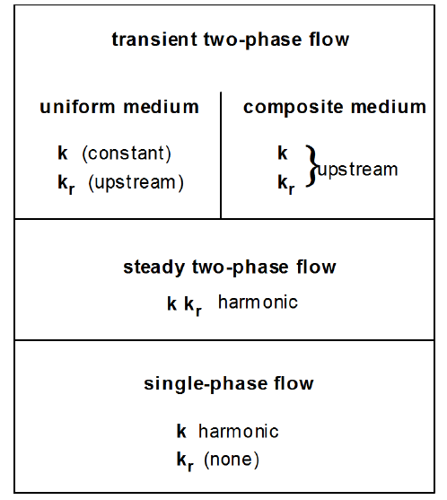

# Interface Weighting Schemes

To obtain a reasonably accurate and efficient solution, particularly for multiphase fluid and heat flow problems, a proper interface weighting scheme should be used. It is well known that for single-phase flow, the appropriate interface weighting scheme for absolute permeability is harmonic weighting. For two-phase flow, the added problem of relative permeability weighting arises. It has been established that for transient flow problems in homogeneous media, relative permeability must be upstream weighted, or else phase fronts may be propagated with erroneous speed (Aziz and Settari, 1979). Studies at the Lawrence Berkeley National Laboratory have shown that for transient two-phase problems in composite (layered) media, both absolute and relative permeability must be fully upstream weighted to avoid the possibility of gross errors (Tsang and Pruess, 1990; Wu et al., 1993). The applicable weighting schemes for different flow problems are summarized in Figure 8. There is no single weighting scheme for general two-phase flows in composite media that would at the same time preserve optimal accuracy for single-phase or steady two-phase flows.

<figure><figcaption>
Figure 8. Weighting procedures for absolute (<em>k</em>) and relative permeability (<em>kr</em>) at grid block interfaces.
</figcaption></figure>

For modeling of fracture-matrix interaction, a different weighting scheme can be applied. If a zero nodal distance is specified, the absolute (and relative, if MOP2(7) > 0) permeability from the other element is used for assignment of interface mobilities.

Another interesting problem is the weighting scheme for interface densities. For proper modeling of gravity effects, it is necessary to define interface density as the arithmetic average between the densities of the two adjacent grid blocks, regardless of nodal distances from the interface. An unstable situation may arise when phases (dis-)appear, because interface density may then have to be “switched” to the upstream value when the phase in question is not present in the downstream block. For certain flow problems, spatial interpolation of densities may provide more accurate answers.

&#x20;Issues of interface weighting and associated discretization errors are especially important when non-uniform or irregular grids are used. Additional complications related to interface weighting arise in flow problems that involve hydrodynamic instabilities. Examples include immiscible displacements with unfavorable mobility ratio where a less viscous fluid displaces a fluid of higher viscosity (viscous instability), and flow problems where a denser fluid invades a zone with less dense fluid from above (gravity instability). These instabilities can produce very large grid orientation errors, i.e., simulated results can depend strongly on the orientation of the computational grid (Yanosik and McCracken, 1979; Pruess and Bodvarsson, 1983; Pruess, 1991c; Brand et al_.,_ 1991).

In some cases, it may be advisable to use higher-order differencing schemes. Grid orientation effects can be reduced by using 7-point or 9-point differencing instead of the common 5-point “stencil,” to achieve a higher degree of rotational invariance in the finite difference approximations of the fundamental differential operators. In the integral finite difference method, these higher-order schemes can be implemented through preprocessing of geometry data, without any coding changes, by assigning additional flow connections with appropriate weighting factors between elements of the computational grid (Pruess and Bodvarsson, 1983; Pruess, 1991c). However, reduction or elimination of grid orientation effects as such does not necessarily achieve a better numerical approximation. It may just amount to reducing the anisotropy of space discretization errors but not their magnitude, creating an illusion of a better approximation by making space discretization effects less obvious (Pruess, 1991c).
