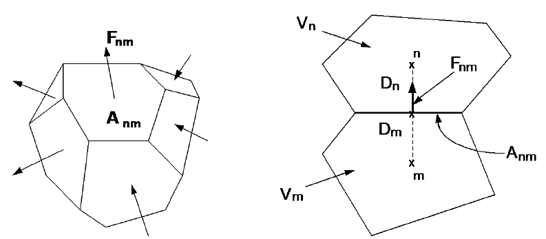

# Space and Time Discretization

TOUGH4 uses an integral finite difference method for space discretization, and first-order fully implicit time differencing. The resulting strongly coupled, nonlinear algebraic equations are solved simultaneously using Newton-Raphson iterations for each time step, which involves the calculation of a Jacobian matrix and the solution of a set of linear equations. Time steps are automatically adjusted during a simulation run, depending on the convergence rate of the iteration process. Newton-Raphson increment weighting can also be adjusted if the iterations oscillate.

The continuum equations Eq. (4-1) are discretized in space using the integral finite difference method (IFD; Edwards, 1972; Narasimhan and Witherspoon, 1976). Introducing appropriate volume averages, we have

$$∫_{V_n}MdV =V_n M_n$$                                                                                                  (5-1)

where _M_ is a volume-normalized extensive quantity, and _Mn_ is the average value of _M_ over _Vn_. Surface integrals are approximated as a discrete sum of averages over surface segments $$A_{nm}$$:

$$∫_{Γ_n}F^κ•n dΓ = ∑_mA_{nm} F_{nm}$$                                                                            (5-2)

Here, $$F_{nm}$$is the average value of the (inward) normal component of **F** over the surface segment $$A_{nm}$$ between volume elements _Vn_ and _Vm_. The discretization approach used in the integral finite difference method and the definition of the geometric parameters are illustrated in Figure 7. &#x20;

<figure><figcaption>
Figure 7. Space discretization and geometry data in the integral finite difference method.
</figcaption></figure>

The flow term $$F_{nm}$$ for phase $$\beta$$ is:

$$F_{\beta,nm}=-\;\ k_{nm}\left[\frac{k_{r\beta}\;\rho_\beta}{\mu_\beta}\right]_{nm}\;\left[\frac{P_{\beta,n}-P_{\beta,m}}{D_{nm}}\;-\;\rho_{\beta,nm}g_{nm}\right]$$                                           (5-3)

where the subscripts (_nm_) denote a suitable averaging at the interface between grid blocks _n_ and _m_ (such as interpolation, harmonic weighting, and upstream weighting, which will be discussed in section for [Interface Weighting Schemes](interface-weighting-schemes.md). $$D_{nm}=D_n+D_m$$is the distance between the nodal points _n_ and _m_, and $$g_{nm}$$ is the component of gravitational acceleration in the direction from _m_ to _n_.

Space discretization of diffusive flux in multiphase conditions raises some subtle issues. A finite difference formulation for total diffusive flux, Eq. (4-10), may be written as

$$(f^\kappa )_{nm}=-(\Sigma_l^\kappa)_{nm}\frac{(X_l^\kappa)_m-(X_l^\kappa)_n}{D_{nm}}-(\Sigma_g^\kappa)_{nm}\frac{(X_g^\kappa)_m -(X_g^\kappa)_n}{D_{nm}}$$                                         (5-4)

This expression involves the as yet unknown diffusive strength coefficients $$\Sigma_l^\kappa)_{nm}$$ and $$\Sigma_g^\kappa)_{nm}$$ at the interface, which must be expressed in terms of the strength coefficients in the participating grid blocks. Invoking conservation of diffusive flux across the interface between two grid blocks leads in the usual way to the requirement of harmonic weighting of the diffusive strength coefficients. However, such weighting may in general not be applied separately to the diffusive fluxes in gas and liquid phases, because these may be strongly coupled by phase partitioning effects. This can be seen by considering the extreme case of diffusion of a water-soluble and volatile compound from a grid block in single-phase gas conditions to an adjacent grid block which is in single-phase liquid conditions. Harmonic weighting applied separately to liquid and gas diffusive fluxes would result in either of them being zero, because for each phase effective diffusivity is zero on one side of the interface. Thus total diffusive flux would vanish in this case, which is unphysical. In reality, tracer would diffuse through the gas phase to the gas-liquid interface, would establish a certain mass fraction in the aqueous phase by dissolution, and would then proceed to diffuse away from the interface through the aqueous phase. Similar arguments can be made in the less extreme situation where liquid saturation changes from a large to a small value rather than from 1 to 0, as may be the case in the capillary fringe, during infiltration events, or at fracture-matrix interfaces in variably saturated media.

TOUGH4 features a fully coupled approach in which the space-discretized version Eq. (5-4) of the total multiphase diffusive flux Eq. (4-10) is re-written in terms of an effective multiphase diffusive strength coefficient and a single mass fraction gradient. Choosing the liquid mass fraction for this we have

$$(f^\kappa )_{nm}=-\{\Sigma_l^\kappa+\Sigma_g^\kappa\frac{(X_g^\kappa)_m-(X_g^\kappa)_n}{(X_l^\kappa)_m-(X_l^\kappa)_n}\}_{nm}\frac{(X_l^\kappa)_m-(X_l^\kappa)_n}{D_{nm}}$$                                                 (5-5)

where the gas phase mass fraction gradient has been absorbed into the effective diffusive strength term (in braces). As is well known, flux conservation at the interface then leads to the requirement of harmonic weighting for the full effective strength coefficient. In order to be able to apply this scheme to the general case where not both phases may be present on both sides of the interface, we always define both liquid and gas phase mass fractions in all grid blocks, regardless of whether both phases are present. Mass fractions are assigned in such a way as to be consistent with what would be present in an evolving second phase. This procedure is applicable to all possible phase combinations, including the extreme case where conditions at the interface change from single-phase gas to single-phase liquid. Note that, if the diffusing tracer exists in just one of the two phases, harmonic weighting of the strength coefficient in Eq. (5-5) will reduce to harmonic weighting of either $$\Sigma_l^\kappa$$ or $$\Sigma_g^\kappa$$. The simpler scheme of separate harmonic weighting for individual phase diffusive fluxes is retained as an option.

Substituting Eqs. (5-1) and (5-2) into the governing Eq. (4-1), a set of first-order ordinary differential equations in time is obtained:

$$\frac{dM_n^\kappa}{dt}=\frac{1}{V_n}\; \sum_{m}{\;  A_{nm}\; F_{nm}^\kappa}\;+\; \ q_n^\kappa$$                                                                          (5-6)

Time is discretized as a first-order finite difference, and the flux and sink and source terms on the right-hand side of Eq. (5-6) are evaluated at the new time level, $$t^{k+1}=t^k+\Delta t$$, to obtain the numerical stability needed for an efficient calculation of multiphase flow. This treatment of flux terms is known as “fully implicit,” because the fluxes are expressed in terms of the unknown thermodynamic parameters at time level _k_+1_,_ so that these unknowns are only implicitly defined in the resulting equations (see, e.g., Peaceman, 1977). The time discretization results in the following set of coupled nonlinear, algebraic equations

$$R_n^{\kappa,k+1}=M_n^{\kappa,k+1}-M_n^{\kappa,k}-\frac{\Delta t}{V_n}\{\sum_{m}{A_{nm}F_{nm}^{\kappa,k+1}}+ V_nq_n^{\kappa,k+1}\}=0$$                 (5-7)

where we have introduced residuals $$R_n^{\kappa,k+1}$$. For each volume element (grid block) _Vn_, there are NEQ mass and heat balance equations (_k_ = 1, 2, ...., NEQ, where NEQ represents the number of equations per grid block). For a flow system with NEL grid blocks, Eq. (5-7) represents a total of NEL x NEQ coupled nonlinear equations. The unknowns are the NEL x NEQ independent primary variables {$$x_i$$_; i_ = 1, ..., NEL x NEQ } which completely define the state of the flow system at time $$t^{k+1}$$. These equations are solved by Newton-Raphson iteration, which is implemented as follows. We introduce an iteration index _p_ and expand the residuals $$R_n^{\kappa,k+1}$$ in Eq. (5-7) at iteration step _p_ + 1 in a Taylor series in terms of the residuals at index _p_.

$$R_n^{\kappa,k+1}\left(x_{i,p+1}\right)=\ R_n^{\kappa,k+1}\left(x_{i,p}\right)+\left.\ \sum_{i}\frac{\partial R_n^{\kappa,k+1}}{\partial x_i}\right|_p\left(x_{i,p+1}-x_{i,p}\right)+...=0$$        (5-8)

Retaining only terms up to first order, we obtain a set of NEL x NEQ linear equations for the increments $$(x_{i,p+1}-x_{i,p})$$:

&#x20;$$-\left.\ \sum_{i}\frac{\partial R_n^{\kappa,k+1}}{\partial x_i}\right|_p\left(x_{i,p+1}-x_{i,p}\right)=R_n^{\kappa,k+1}\left(x_{i,p}\right)$$                                                     (5-9)

All terms $$\partial R_n/\partial x_i$$ in the Jacobian matrix are evaluated by numerical differentiation. Eq. (5-9) is solved by the linear equations solver selected. Iteration is continued until the residuals $$R_n^{\kappa,k+1}$$ are reduced below a preset convergence tolerance.

$$\left|\frac{R_{n,p+1}^{\kappa,k+1}}{M_{n,p+1}^{\kappa,k+1}}\right|\le\varepsilon_1$$                                                                                                              (5-10)

The default (relative) convergence criterion is $$\varepsilon_1=10^{-5}$$. When the accumulation terms are smaller than $$\varepsilon_2$$(default $$\varepsilon_2=1$$), an absolute convergence criterion is imposed,

$$R_n^{\kappa,k+1} \le \varepsilon_1 . \varepsilon_2$$                                                                                                           (5-11)

Convergence is usually attained in 3 to 4 iterations. If convergence cannot be achieved within a certain number of iterations (default 8), the time step size _Dt_ is reduced and a new iteration process is started.

In TOUGH4, we also adopt the maximum change of primary variables (the solutions of eq. (5-9)) as another convergence criterion. Convergence is attained once the maximum solutions of the eq. (5-9) is less than the given criterion. This approach is helpful for some specific situation, such as $$M_{n,p+1}^{\kappa,k+1}$$ is very small. Different primary variables may have different criterion. In TOUGH4, three criteria are used for pressure type, saturation/mass fraction type, and temperature type primary variables, respectively (see input Record [**PARAM.3**](../preparation-of-model-input/keywords-and-input-data/param.md)).  &#x20;

It is appropriate to add some comments about this space discretization technique. The entire geometric information of the space discretization in Eq. (5-7) is provided in the form of a list of grid block volumes $$V_n$$, interface areas $$A_{nm}$$, nodal distances $$D_{nm}$$ and components $$g_{nm}$$ of gravitational acceleration along nodal lines. There is no reference whatsoever to a global system of coordinates, or to the dimensionality of a particular flow problem, but special attention must be paid to the wellbore simulation which requires the z coordinates for calculation of potential energy. The discretized equations are in fact valid for arbitrary irregular discretizations in one, two or three dimensions, and for porous as well as for fractured media. This flexibility should be used with caution, however, because the accuracy of solutions depends upon the accuracy with which the various interface parameters in equations such as Eq. (5-3) can be expressed in terms of average conditions in grid blocks. A general requirement is that there exists approximate thermodynamic equilibrium in (almost) all grid blocks at (almost) all times (Pruess and Narasimhan, 1985). For systems of regular grid blocks referenced to global coordinates (such as _r_ - _z_ or _x_ - _y_ - _z_), Eq. (5-7) is identical to a conventional finite difference formulation (e.g., Peaceman, 1977; Moridis and Pruess, 1992).&#x20;
